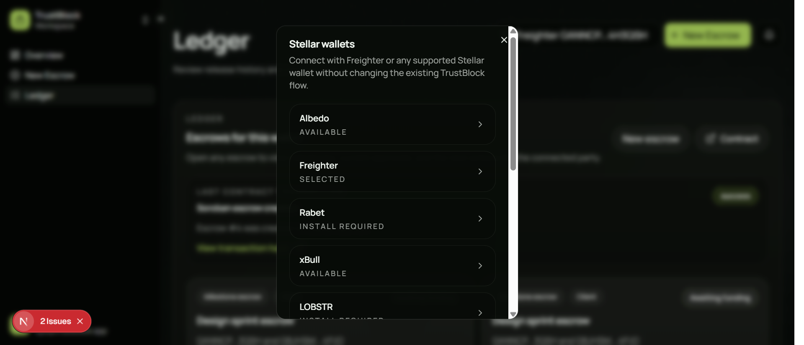
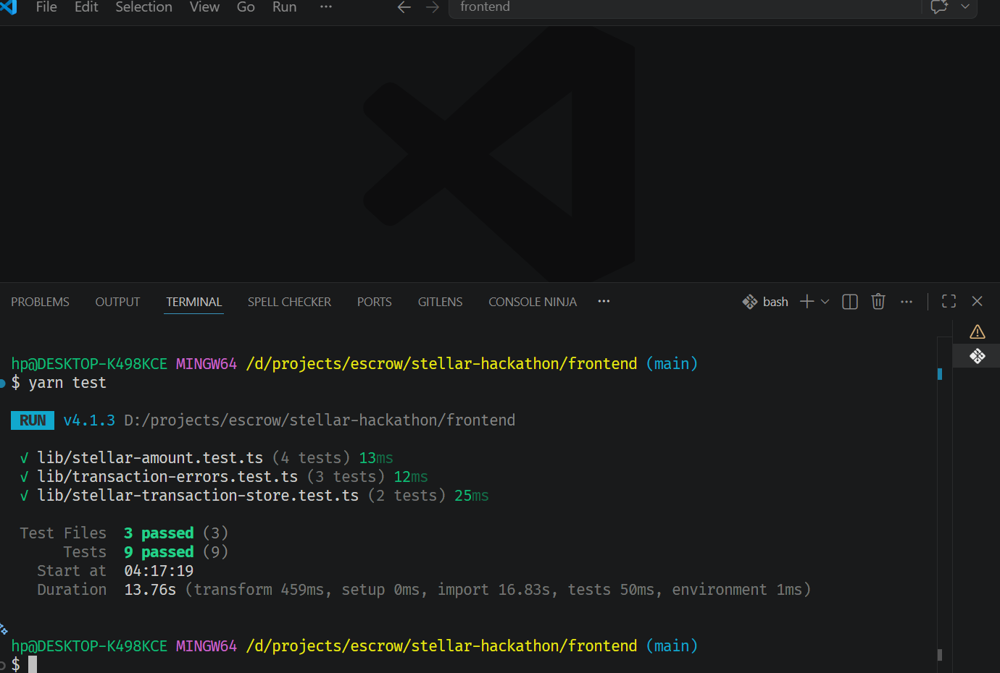
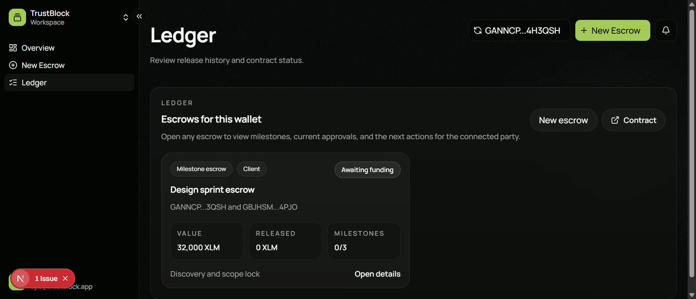

# TrustBlock

TrustBlock is a milestone-based escrow mini-dApp for structured crypto payments, implemented for both EVM and Stellar tracks.

The active hackathon submission path in this repository is the Stellar track under `apps/stellar`.

## Implementations in this Repository

### Stellar Track (Hackathon path)

- `apps/stellar/contract`: Soroban smart contract and tests
- `apps/stellar/web`: Next.js frontend with wallet and transaction flows

### EVM Track (reference/parallel implementation)

- `apps/evm/smart-contracts`: upgradeable Solidity escrow contracts and tests
- `apps/evm/web`: EVM-facing frontend and contract integration utilities

This README is intentionally status-accurate and maps each requirement to concrete project evidence.

## Problem

Freelance, agency, and service-based crypto payments often break down in the same places:

- funds are sent too early or too late
- delivery expectations are vague
- milestone approval logic is inconsistent
- disputes are handled off-platform and without structured rules

TrustBlock addresses this by combining milestone-aware escrow contracts with a UI designed around explicit release, review, and dispute paths.

## Current Status

What is implemented today:

- Soroban escrow contract flow (initialize, create escrow, fund, submit, approve, release, refund)
- frontend wallet + payment flows in the Stellar web app
- automated smart contract tests for lifecycle and guard paths
- responsive app shell and components in the web UI
- EVM escrow + reader architecture remains available for reference/inter-contract read model pattern

## Repository Structure

```text
.
|- apps/
|  |- evm/
|  |  |- smart-contracts/
|  |  `- web/
|  `- stellar/
|     |- contract/
|     `- web/
|- CONTRIBUTING.md
|- CODE_OF_CONDUCT.md
|- SECURITY.md
`- LICENSE
```

## Quick Start

### Stellar Track (Primary)

#### Smart contract

```bash
cd apps/stellar/contract
cargo test
```

#### Web app

```bash
cd apps/stellar/web
yarn install
yarn dev
```

### EVM Track (Reference)

#### Smart contracts

```bash
cd apps/evm/smart-contracts
yarn install
yarn compile
yarn test
```

For network deployments, use Hardhat config variables backed by the Hardhat keystore instead of storing secrets in `.env` files:

```bash
npx hardhat keystore set ARBITRUM_RPC_URL
npx hardhat keystore set ARBITRUM_PRIVATE_KEY
npx hardhat keystore set ARBITRUM_SEPOLIA_RPC_URL
npx hardhat keystore set ARBITRUM_SEPOLIA_PRIVATE_KEY
```

### Web app

```bash
cd apps/evm/web
yarn install
yarn dev
```

If you want wallet connection enabled in the EVM web app, create `apps/evm/web/.env.local` and set:

```bash
NEXT_PUBLIC_REOWN_PROJECT_ID=your_reown_project_id
NEXT_PUBLIC_ESCROW_DEPLOYMENT=arbitrumSepolia
```

Switch `NEXT_PUBLIC_ESCROW_DEPLOYMENT` to `arbitrum` to target the mainnet deployment registry.

## Requirement Checklist

### Core requirements

- [x] Mini-dApp fully functional  
       Evidence: Stellar web route supports wallet + transaction flow (`apps/stellar/web/README.md`).
- [x] Minimum 3 tests passing  
       Evidence: 4 contract tests in `apps/stellar/contract/tests/contract.rs`.
- [x] README complete  
       This document now includes architecture, setup, and requirement mapping.
- [x] Demo video recorded  
       Status: demo walkthrough has been recorded.

       https://tinyurl.com/29m3pdvc

- [x] Minimum 3+ meaningful commits  
       Evidence provided by user: `git rev-list --count HEAD` = 5.
- [x] Deliverable: complete mini-dApp with documentation and tests  
       Implemented in `apps/stellar/contract` + `apps/stellar/web`.

### Extended requirements

- [x] Inter-contract call working (if applicable)  
       Status: Not required in Stellar flow (single contract path). EVM track includes contract-to-contract read model separation (`Escrow` + `EscrowReader`).
- [x] Custom token or pool deployed (if used)  
       Status: Not used in Stellar flow (native XLM), therefore not required.
- [x] CI/CD running  
       Evidence: GitHub Actions workflow at `.github/workflows/ci.yml` runs contract tests plus web lint/test/build checks.
- [x] Mobile responsive  
       Evidence: responsive shell/components documented in `apps/stellar/web/README.md`.
- [x] Minimum 8+ meaningful commits

## Screenshots

### Stellar app proof







## Docs

- Stellar contract guide: [apps/stellar/contract/README.md](./apps/stellar/contract/README.md)
- Stellar web guide: [apps/stellar/web/README.md](./apps/stellar/web/README.md)
- EVM contracts guide: [apps/evm/smart-contracts/README.md](./apps/evm/smart-contracts/README.md)
- EVM web guide: [apps/evm/web/README.md](./apps/evm/web/README.md)

## Contributing

Please read [CONTRIBUTING.md](./CONTRIBUTING.md) before opening a pull request.

## Security

Please report vulnerabilities according to [SECURITY.md](./SECURITY.md).

## License

This repository is released under the [MIT License](./LICENSE).

## Feedbacks

https://docs.google.com/spreadsheets/d/1Q-HN9M1OJNaNh_1g3KFRfPq4aL0l0JI27n1Og1XO6ps/edit?resourcekey=&gid=1847759737#gid=1847759737
